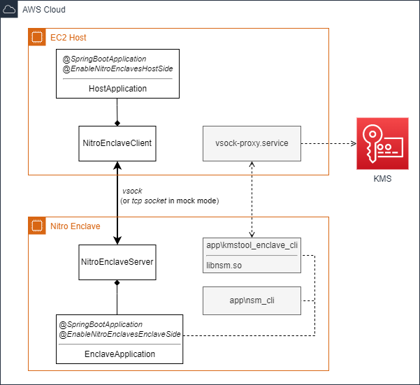

# Spring Boot Nitro Enclave  [](https://github.com/mrgatto/spring-boot-nitro-enclaves/actions/workflows/maven.yml)  


This is a working (and usable) _proof of concept_ Spring Boot library for easy creation of [AWS Nitro Enclaves](https://docs.aws.amazon.com/enclaves/latest/user/nitro-enclave.html) applications.

**Objectives:**

- Easy development of Nitro Enclaves applications.
- Abstraction of the _vsock_ host-enclave communication with a TCP implementaion for easy local test/development (even on Windows :sunglasses:). 
- Ready-to-use integration with the Nitro Security Module (NSM).
- Ready-to-use integration with the AWS KMS.

# Introduction

An _enclave_ is a protected memory region that provides confidentiality for data and code execution. It is an instance of a Trusted Execution Environment (TEE)
which is usually secured by hardware.

An enclave application partitions itself into two components:

1. An untrusted component (called the **host**) and
2. A trusted component (called the **enclave**).

# Overview

<p align="center">
  
</p>

## Setup

### Enclave Application

```java
@SpringBootApplication
@ComponentScan({ "my.app.package" })
@EnableNitroEnclavesEnclaveSide
public class NitroEnclaveApplication {

  public static void main(String[] args) {
    ApplicationContext ctx = SpringApplication.run(NitroEnclaveApplication.class, args);

    NitroEnclaveServer server = ctx.getBean(NitroEnclaveServer.class);
    server.run();
  }
}

// -- Handlers

@Component
public class MyActionHandler extends AbstractActionHandler<MyPojoData, MyPojoDataResult> {

  @Override
    public boolean canHandle(String action) {
      return "action_to_execute".equalsIgnoreCase(action);
    }

    @Override
    public MyPojoDataResult handle(MyPojoData data) {
      // my logic
    }
}
```

### Host Application

```java
@SpringBootApplication
@ComponentScan({ "my.app.package" })
@EnableNitroEnclavesHostSide
public class NitroEnclaveHostApplication {

  public static void main(String[] args) {
   ApplicationContext ctx = SpringApplication.run(NitroEnclaveHostApplication.class, args);
   NitroEnclaveClient client = ctx.getBean(NitroEnclaveClient.class);

   // Your Enclave interaction
   EnclaveRequest<MyPojoData> request = new EnclaveRequest<>();
   request.setAction("action_to_execute");
   request.setData(myPojo);

   EnclaveResponse<MyPojoDataResult> response = client.send(request);	  
  }
}
```

# Parameters

```yaml
nitro:
  enclave:
    port: 5000
    network-mode: vsock # or 'tcp' the default value for easy development
    nsm-cli: /app/nsm-cli # default value, for NSM integration
    kmstool-enclave-cli: /app/kmstool_enclave_cli # default value, for KMS integration
```

# Tools / Libs

* [aws-nitro-enclaves-cli](https://docs.aws.amazon.com/enclaves/latest/user/nitro-enclave-cli-install.html)

* kmstool-enclave-cli & libnsm.so

 Build instructions at [kmstool-enclave-cli](https://github.com/aws/aws-nitro-enclaves-sdk-c/tree/main/bin/kmstool-enclave-cli).

* vsockj

This project uses the _vsockj_ library for vsock communication.
Build instructions at [vsockj](https://github.com/Cloud-Architects/vsockj).

* [nsm-cli](https://github.com/mrgatto/nsm-cli)

For interaction with the Nitro Security Model.


# Examples

* [Hello World Echo](examples/simple-echo)
* [KMS Decrypt](examples/kms-decrypt)
